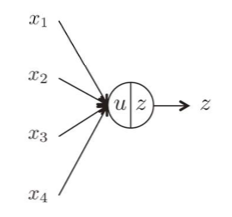

# 記法
$\mathbf{x}=[x_1,\cdots,x_n]$は$n\in\mathbb{N}$ 次元列ベクトルを表す。
$\mathbf{X}=[\mathbf{x}_1,\cdots,\mathbf{x}_n]$ は $\mathbb{N}\times\mathbb{N}$ の行列。

# ユニット (unit)
ニューラルネットワークにおいて、基本構成要素となるのがユニット(ニューロンと呼ばれることもある)である。

ユニットは以下のような数式で表せる。

$$
    u = \mathbf{w}^\mathsf{T}\mathbf{x} + b\\
    z = \phi(u)
$$

$\mathbf{w}$ は重み(weight)、$b$ はバイアス(bias)、 $\phi(\cdot)$は活性化関数と呼ばれる。重み及びバイアスを合わせてパラメータ $\theta = \{\mathbf{w}, b\}$ と呼ぶ。

**Warning**
ここで書いてあるパラメータや活性化関数などは、論文や資料によって、文字が違います。
途中で変わることもあります(明示されてると思いますが)。
式がどのような構造になっているかを覚えること！文字をそのまま覚える人は爆発します。

ニューラルネットワークは、このユニットの繋ぎ方によって大別される。
- Feedforward neural networks:FFNN
- Mutually connected neural networks

## 活性化関数

# 単純パーセプトロン (Simple perceptron)
単純パーセプトロンは、文字通りFFNNの一番単純なモデルである。

$$
    \mathbf{u} = \mathbf{W}^\mathsf{T}\mathbf{x} +  \mathbf{b}\\
    \mathbf{z} =  \boldsymbol\phi(\mathbf{u})
$$

# 多層パーセプトロン (Multilayer perceptron)

$l$-層パーセプトロン は以下の式で表せられる。

$$
    \mathbf{z}^{(0)} = \mathbf{x}\\
    \mathbf{u}^{(l)} = \mathbf{W}^{(l)\mathsf{T}}\mathbf{z}^{(l-1)} +  \mathbf{b}^{(l)}\\
    \mathbf{z}^{(l)} = \boldsymbol\phi^{(l)}(\mathbf{u}^{(l)})
$$

# 生成モデル
データ $\mathbf{x}$が未知の確率分布$p_g(\mathbf{x})$ から生成、つまりサンプリング  $\mathbf{x}\sim p_g(\mathbf{x})$ によって得られていると考える。

真の $p_g(\mathbf{x})$ はわからないので、適当なパラメータ $\theta$ を持った  $p_\theta(\mathbf{x})$ によってモデル化を行う。

**note**
$p_\theta(\mathbf{x})$ は本来は $p(\mathbf{x}|\theta)$ と書きます。ただ、よくわからないけど、深層学習の文脈においては $p_\theta(\mathbf{x})$ とたいてい記述されます。パラメータと確率変数を分けて書くためなのかな?

# 深層生成モデル
一般に生成モデルでは、グラフィカルモデルをユニットを用いて実装する。

深層生成モデルは、グラフィカルモデルをDNNを用いて実装するモデルである。

## Energy Based Model(EBM)
EBMは、ある