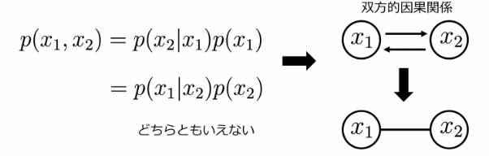
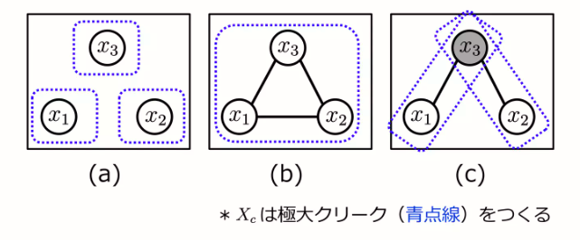

# 記法
確率及び確率分布(確率測度)は $\mathrm{Pr}$ 、確率密度(質量)関数は $p$ で表す。

確率関数からのサンプリングを $x \sim p(x)$ で表す。

# はじめに
現代の機械学習モデル、特にDNNを扱うモデルにおいて、確率モデルを用いないものはほぼないといってよいでしょう。

しかしながら、DNN初学者が読む本においては、DNNの仕組み及び実装方法のみが語られ、残念ながら確率モデルに触れられることはありません。

そうした結果、最新の論文を読む際に、訳の分からない理論の羅列に曝され、悲惨な死を迎える事になるでしょう。少なくとも私は学部4年から修士1年のときは、ほぼ死体も同然でした。

今回は、皆さんがそういった悲しい事件を迎えないために、確率モデルの基礎についてお話ししたいと思います。

また今回の内容がまったくわからない、あまり勉強したくない、学部で卒業するつもりだ、という方々は、自分の研究から「機械学習モデルを作る」という過程を「最新のAIのAPIを使う」に変える事をお勧めします。確率モデルは数学に触れてこなかった我々人間科学部生にとっては、少々内容が重たく、またその重さが年々とんでもないものになっています。特に今回説明予定であった拡散モデルを理解するには、冗談抜きで「確率論(数学科3,4年が扱う内容)」を知っておく必要があります。

深淵に触れる必要がない、研究設計を行うほうが身のためです。APIを使ったほうが研究結果も出しやすいでしょう。それでも今回の内容に興味を持ったという方は"死ぬ気"で数学をしていきましょう。

## 今回の目標
- 確率モデルの基礎の理解
    - 最新のDNNを扱うモデルの論文を読む権利を得られる程度を目指す
    - 現状だと藤後以外権利がないと思われる

- 確率モデルの理解に必要な知識のえぐさを知る
    - 皆さんがアビスに誤って足を踏み入れないようにする
        - リコみたいに頭がおかしい方は別に入ってもいいです

# 確率と確率分布の基本
まず確率モデルの話をする前に、確率と確率分布について学びましょう。

**note** できるだけわかりやすく書いたつもりです。そのため、数学的にはごまかして書いている部分が多量に含まれます。

☆: 覚える必要ないが説明上必要な内容

☆☆: 覚えてほしいが難しいので軽めに流してほしい内容

☆☆☆: 覚えてほしい内容

## 集合の復習(☆☆☆)
集合は「ものの集まり」である。集合の元(要素)として集められる対象となる、「もの」は、数、文字、記号をはじめ、どんなものでも構わない。

「集まり」が集合呼ばれるためには、対象が「その集まりの源であるかどうかが不確定要素なしに一意に決定できる」ように定義されなければならない。

**note**「集まり」を「関東圏の都道府県」とした時に「山梨」はどうなるんかわからんよね〜

「 $\omega$ が集合(個体変数) $\Omega$ の元である」という文は

$$
    \omega \in \Omega
$$

という式で示される。

## 標本空間(☆☆☆)
標本空間とは、起こりうる結果全体の集合の事をいう。

ここでは標本空間は $\Omega$ 、標本空間の元(標本)を $\omega$ と表記する。

## 事象(☆☆)
事象とは標本空間の部分集合、言い換えると、試行によって起こり得る結果をいくつか集めた集合のことを言い、確率をもつと考えられるもののことである。ここでは基本的に事象は $A$ で表記する。

すべての事象 $A$ を集めた集合族 $\mathcal{F}$ は $\sigma$ 加法族である必要がある。これ以上分解できない事象を根元事象、複数の根元事象の和集合を複合事象という。つまり $\mathcal{F}$ は、根元事象から生成される最小の $\sigma$ 加法族となっている。

上の文を簡単に説明します。

さいころを1回投げる試行を考えてみましょう。この時、標本空間 $\Omega$ はさいころの出る目全体だと考えることができます。

$$
    \Omega := \lbrace 1,2,3,4,5,6\rbrace
$$

事象 $A$ というのは $\Omega$ の部分集合です。

$$
    A \subseteq \Omega
$$

つまり $A$ の例として以下のようなものが考えることができます。

$$
    \lbrace 1\rbrace , \lbrace 2,4,6\rbrace, \lbrace 2,3,5\rbrace
$$

この時、得られるすべての $A$ をすべて集めたものが $\mathcal{F}$ です。またこの例での根元事象は $\lbrace 1\rbrace$ であり、複合事象は $\lbrace 2,4,6\rbrace, \lbrace 2,3,5\rbrace$ です。

一般に根元事象は標本のみを要素に持つ集合 $\lbrace\omega\rbrace$ です。大抵の場合同一視され、根元事象を記述する際に省略された書き方 $\omega$ で表されることが多いです。

## 確率(☆☆)
標本空間と事象の集合族の組 $(\Omega, \mathcal{F})$ において、 $\mathrm{Pr}$ が以下の性質を持つとき、 $\mathrm{Pr}(A)$ を $A$ の確率と呼ぶ。

1. $\mathrm{Pr}:\mathcal{F} \rightarrow \mathbb{R}_{\geq 0}$
2. $\mathrm{Pr}(\Omega)=1$
3. $A_n \in\mathcal{F}, n\in\mathbb{N}$ かつ $A_i \cap A_j = \emptyset \ (\forall i \neq j)$ のとき、

$$
    \mathrm{Pr} \Bigl( \textstyle\bigcup\limits_{n=1}^\infty A_n \Bigr) = \sum\limits_{n=1}^\infty \mathrm{Pr}(A_n)
$$

この時、3つ組 $(\Omega, \mathcal{F}, \mathrm{Pr})$ を確率空間という。

### 確率空間の例(☆☆☆)
コインを投げて裏と表が出る確率が、それぞれ $1/2$ であることを確率空間として表したとき、例えば次のようになる。

- $\Omega:=\lbrace裏, 表\rbrace$
- $\mathcal{F} := \mathfrak{\mathrm{Pr}}(\Omega) = \lbrace \emptyset, \lbrace裏\rbrace , \lbrace表\rbrace , \lbrace裏, 表\rbrace \rbrace$
- $\mathrm{Pr}(\lbrace裏\rbrace)=\mathrm{Pr}(\lbrace表\rbrace)=\frac{1}{2}$

この定義において、確率空間 $(\Omega, \mathcal{F}, \mathrm{Pr})$ はコイントスのモデルとなっていることがわかる。

## 確率変数(☆☆)
先ほどのコインの例だと困ることがあります。それは、計算がしづらいというところです。裏、表などを数学の議論でそのまま扱うことは難しいですよね。

そのため試行の結果に数字を割り当てるといったことを行います。これが確率変数です。

確率空間 $(\Omega, \mathcal{F}, \mathrm{Pr})$ が与えられたとき、確率変数 $X:\Omega\rightarrow E$ は、標本空間 $\Omega$ の標本 $\omega$ に値を対応させる関数です。この時に対応させる値は自然数や実数または実数ベクトルなどがあげられます。

確率空間の $(\Omega, \mathcal{F})$ を、 確率変数 $X$ を使って別の(可測)空間 $(E, \mathcal{E})$ に対応付けると考えやすいです。 

$X$ の値として、測定値や観測値(身長や体重)あるいは指示関数値(コインの裏表)を採用することが多いです。

何らかの事象 $\omega$ が観測されたとき、それを確率変数 $X$ で表した値、 $X(\omega)$ を実現値と呼びます。今回の資料では基本的に $x := X(\omega)$ で表します。

## 確率分布(☆☆)
確率分布は、各確率変数が取る確率全体を表したものです。つまり、 $E$ が取る値をすべて列挙したものと考えることができます。

確率空間 $(\Omega, \mathcal{F}, \mathrm{Pr})$ と確率変数 $X:\Omega\rightarrow E$ が与えられたとき、可測空間 $(E, \mathcal{E})$ に定義された確率分布 $\mathrm{Pr}_X$ は、以下の式で表すことができる。

$$
    \mathrm{Pr}_X(B) :=  \mathrm{Pr}(X^{-1}(B)), B\in\mathcal{E}
$$

確率変数 $X$ の確率分布が $\mu$ であるとき、 $X$ は $\mu$ に従う確率変数であるといい、 $X \sim \mu$ と書く。

## 確率関数(☆☆)
**note** 資料において確率関数といった場合は、確率質量関数と確率密度関数をまとめたものを指す。

確率変数が離散値のとき、確率分布は次のように表すことができる。

$$
    \mathrm{Pr}_X(B) = \sum_{x\in B}p_X(x)
$$

この時、 $p_X(x)$ を確率質量変数と言います。また確率質量変数について以下の等式が成り立ちます。

$$
    p_X(x) = \mathrm{Pr}(X=x)=\mathrm{Pr}_X(\lbrace x\rbrace)
$$

対して、確率変数が連続値のとき、確率分布は次のように表すことができる。

$$
    \mathrm{Pr}_X(B) = \int_B p_X(x)dx
$$

この時、 $p_X(x)$ を確率密度関数と言います。

確率関数の定義をみると、確率(確率分布)は面積の足し合わせであることがわかります。このことから、面積として捉えることができる確率質量関数は、確率ということができ、面積ではない確率密度関数は確率ではないのです。

また、確率関数 $p_X(x)$ は確率変数の記述を略記して、 $p(x)$ と書くことが多いです。

## 同時分布(☆☆)
**note** 簡単に説明してますが、存在証明が鬼ほど難しいです。

各標本が多次元である場合(コインを複数回投げる、両親の身長・体重)を考えてみましょう。

つまり、確率空間 $(\Omega, \mathcal{F}, \mathrm{Pr})$ の標本 $\omega$ が、$N$ -組

$$
    \omega = (\omega_1,\cdots,\omega_N)
$$

のように与えられる場合を考えます。

この時、確率変数も各 $\omega$ に対応させるように、 $N$ -組 $\mathcal{X} := (X_1,\cdots,X_N)$ として考える事ができます。

よって、確率空間 $(\Omega, \mathcal{F}, \mathrm{Pr})$ と確率変数 $\mathcal{X}:\Omega\rightarrow E$ が与えられたとき、可測空間 $(E, \mathcal{E})$ に定義された確率分布 $\mathrm{Pr}_\mathcal{X}$ の事を、同時分布と言います。

$$
    \mathrm{Pr}_\mathcal{X}(B) :=  \mathrm{Pr}(\mathcal{X}^{-1}(B)), B\in\mathcal{E}
$$

また同時分布に対応する確率関数を、同時確率関数と呼ぶことにします。

確率変数 $\mathcal{X}$ によって与えられる実現値も以下のような $N$ -組になります。

$$
    \mathbf{x} := (x_1,\cdots,x_N) 
$$

よって同時確率関数は、 $p_\mathcal{X}(x_1,\cdots,x_N)=p_\mathcal{X}(\mathbf{x})$ と表すことができます。

## 同時分布に関する重要定理(☆☆☆)
**note** これだけは絶対覚えてください。これを覚えておけば基本的に論文が読めます。

加法定理

$$
\begin{align*}
    p(x) = \sum_y p(x,y) \\
    p(x) = \int_y p(x,y)dy
\end{align*}
$$

乗法定理

$$
    p(x,y) = p(x|y)p(y)
$$

ここまでで確率の基本はおしまいです。

# グラフィカルモデル
確率モデルはグラフィカルモデルというもので記述できます。

グラフィカルモデルは確率変数間の「依存関係」をグラフ表現するモデルです。機械機械学習では定番のモデルとなってます。

このように数式をグラフ表現にすることで、確率モデルの構造をわかりやすくすることができます。

**note** この「依存関係」は自分で「仮定」して決めるものです。数式の式変形で導けるものではありません。データをみてこんな依存関係を持っているだろう、ということをモデル化しているのです。

また、以下のような例を数式で表そうとすると、数式を書くのも理解するのも、とても大変なのでできるだけグラフで記述したいわけですね。

## よく使われるグラフィカルモデル
今回はグラフィカルモデルの内、2つのモデルについて説明したいと思います。

- ベイジアンネットワーク
- マルコフ確率場

**note** これらのより一般化(両方を取り扱える)した概念として、chain graph や ancestral graph があるが、まだ機械学習モデルの記述の際に話に出てきてる事はない。元論文自体日本語訳されていないが、拡散モデルの説明に使えるグラフなのでそのうち論文とかに出てくるかもしれない。

2つのモデルについて、先に問題設定を与えておきましょう。

観測値 $y_{1:M} :=\lbrace y_1, \cdots, y_M\rbrace$ が与えられているもとで、潜在変数 $x_{1:N} :=\lbrace x_1, \cdots, x_N\rbrace$ の条件付き確率関数を求めよ。

$$
    \text{find } p(x_{1:N}|y_{1:M})
$$

例えば、観測値は「一部分が欠けた画像の各画素の値」としたら、潜在変数は「欠けた部分の各画素の値」など考えられるでしょう。

また、グラフィカルモデルでは観測されたノードを塗りつぶして書くことが多いです。

### ベイジアンネットワーク(有向グラフィカルモデル)
ベイジアンネットワークは、一般に次のような式で表されます。

$$
    p(x_{1:N}) = \prod_{n=1}^N p(x_n|\mathrm{pa}_n)
$$

ここで、 $\mathrm{pa}_n$ は $x_n$ の親ノードの集合です。

以下に例を並べておきます。ちゃんと並んでないのは許してください。

$$
\begin{align*}
    p(x_1, x_2, x_3) = p(x_1|x_2, x_3)p(x_2|x_3)p(x_3) \cdots (\text{a}) \\
    p(x_1, x_2, x_3) = p(x_1|x_3)p(x_2|x_3)p(x_3) \cdots (\text{b}) \\
    p(x_1, x_2, x_3) = p(x_N|x_{1:N-1})\prod_{n=1}^{N-1}p(x_n)\cdots (\text{c}) \\
\end{align*}
$$

グラフィカルモデルの説明でも述べましたが、同時分布の分解は一意に定まらないので、データをみて、自分で仮定してモデルを作る必要があります。

*本来はどっちもあってる。*

$$
\begin{align*}
    p(x_1, x_2) &= p(x_2|x_1)p(x_1) \\
    &=  p(x_1|x_2)p(x_2)
\end{align*}
$$

### マルコフ確率場(無向グラフィカルモデル)
先ほど仮定した依存関係を、どっちかわからないまま扱いたいときに利用するのが、マルコフ確率場です。

マルコフ確率場は、一般に次のような式で表されます。

$$
    p(x_{1:N}) = \frac{1}{Z}\prod_{c=1}^C \phi_c(\mathbf{x}_c),
    \phi_c > 0, 
    \mathbf{x}_c \subseteq	\lbrace x_1, \cdots, x_N\rbrace
$$

この時、 $\phi_c$ はポテンシャル関数(いろいろ呼び方がある)とよばれます。ポテンシャル関数自体は確率関数である必要はなく、適当な関数で大丈夫です。つまり自由にモデリングできます。

ただし、最終的な結論である $p(x_{1:N})$ が確率関数の条件を満たす必要があります。そのために正規化項(これもいろんな名前がある)として $Z$ が導入され、最終的に総和が $1$ になるようになってます。

以下に例を並べておきます。

$$
\begin{align*}
    p(x_1, x_2, x_3) = \phi_1(x_1)\phi_2(x_2)\phi_3(x_3) \cdots (\text{a}) \\
    p(x_1, x_2, x_3) = \phi(x_1,x_2,x_3) \cdots (\text{b}) \\
    p(x_1, x_2, x_3) = \phi_1(x_1,x_3)\phi_1(x_2,x_3)\cdots (\text{c}) \\
\end{align*}
$$

# モデルとは何か
ここまで、グラフィカルモデルについて説明してきましたが、改めて「モデル」とは何なのかを考えましょう。

一般的なモデルの説明

統計学、機械学習におけるモデルは、すべて数理モデルをさす。

## 数理モデルとは
書ききれん・・・

## (一般的に言われる)統計モデリングと機械学習の違い
「世の中の現象を、確率論を応用した数理モデルを用いて表現する」という点において、統計モデリングと機械学習は基本的に違いがない。そのため、使用される道具(モデル)が同じものであったり、一方で提案された道具が他方で使用されることも珍しくない。

では何が違うのかというと、最終的に行いたいタスクが微妙に違うという点にある。統計モデリングはモデルの説明、機械学習はデータの推論がタスクである。

統計モデリング・機械学習では、世の中に存在する何らかのデータ集合 $\mathcal{D} = \lbrace\mathbf{x}^{(0)},\cdots,\mathbf{x}^{(N)}\rbrace$ は、データに関する未知の確率関数 $p^*(\mathbf{x})$ から生成されている、言い換えるとサンプリング $\mathbf{x}\sim p^*(\mathbf{x})$ によって得られていると考える。

この時、統計モデリングは $p^*$ がどのようなものなのかを考えることがタスクであり、機械学習では、 $\mathbf{x}\sim p^*(\mathbf{x})$ をどうやって作り出す(方法は問わない)かがタスクである。

このスタンスの違いによって、統計モデリングは"主に"確率論的なモデリング手法が取られる、機械学習は"主に"決定論的なモデリング手法が取られる、という"イメージ"が存在する。

**note** 問題設定に決定論的な立場を取る機械学習モデルは存在しないが、実応用のときに、出力が一意に決まるように、モデル化及び実装しているという場合が多い(特にニューラルネットは決定論的モデルの例として挙げられるが、決定論的に使用できるだけであって本当は確率論的モデルである)。その結果、誤って問題設定に統計的な要素を持たないような説明がされることが多い。

## 教師あり学習と教師なし学習
書ききれん・・・

## 決定論的(Deterministic)モデリングと確率論的(Stochastic)モデリング

決定論的モデルは、「入力と出力が一意に定まるモデル」のことを指します。
つまり、数式で表すと以下のような、関数で表すことができます。

$$
    y = f(x)
$$

対して確率論的モデルは、「入力と出力が確率的に定まるモデル」を指します。
つまり、数式で表すと以下のような、確率関数からのサンプリングで表すことができます。

$$
\begin{align*}
    x \sim p(x) \\
    y \sim p(y|x)
\end{align*}
$$

## 統計的機械学習
前項で決定論的モデリングと確率論的モデリングについて述べました。では実際の現象に機械学習を使う場面において、どちらを使うべきなのでしょうか。

正解は「どちらも使う」です。

**note** 機械学習の分野において、対立関係のような感じで説明されたものは、最終的に合わせて使われることになります。「何らかの手法のどちらを使うべきか」という問いへの解答は「どちらも使う」か「別の方法を作る」です。

機械学習において、統計学で用いられる確率論的なモデリングを行うもの、つまりどちらのモデリング手法も使う方法を、統計的機械学習と呼びます。

**note** 個人的には確率論的機械学習じゃないかと思う。

一例ですが、先程のように式で表すと、確率関数と通常の関数を組み合わせたようなモデルであることが多いです。

$$
\begin{align*}
    x \sim p(x) \\
    y = f(x)
\end{align*}
$$

近年の深層学習モデルと呼ばれるもの、特に(深層)生成モデルは、統計的機械学習が主です。確率分布を使用してモデリングを行い、確率分布をDNNで実装するという手法がとられています。

# 生成モデル
**warning** 生成モデルは、「生成」が「タスク」として認識しているか否かで、意味が相当異なる。今回の説明は「生成」が「タスク」として認識している場合のものである。

統計学・機械学習において、世の中に存在する何らかのデータ集合 $\mathcal{D} = \lbrace\mathbf{x}^{(0)},\cdots,\mathbf{x}^{(N)}\rbrace$ は、データに関する未知の確率関数 $p^*(\mathbf{x})$ から生成されている、言い換えるとサンプリング $\mathbf{x}\sim p^*(\mathbf{x})$ によって得られていると考える。

つまり、未知の確率関数 $p^*(\mathbf{x})$ がどのような関数か知ることができれば、サンプリングによってデータを得ることができるわけである。

よって生成モデルは、得られたデータ $\mathcal{D}$ を用いて、未知の確率関数 $p^*(\mathbf{x})$ のもっともらしい近似 $p(\mathbf{x})$ を得ることが目標である。

**note** どのような手法で近似を行うか考える際に、サンプリングの簡便さが深くかかわってくるが、今回は全く説明しない。特に拡散モデルはサンプリングを簡便にできたから提唱されたモデルであるので、詳しくは論文等を読んで勉強してください。

生成モデルは主に二つの手法に大別される。
- 尤度ベースモデル
- 暗黙的生成モデル
    - GANなど

**note** ちなみに大別されるとか言ったけど、両方の組み合わせたモデルのほうが多い

今回は主に尤度ベースモデルについて説明する。

## 尤度ベースモデル
尤度ベースモデルにおいて、 与えられたデータの生成確率は、パラメータ $\theta$ を持つ関数 $p(\mathbf{x}; \theta)$ で表される。 この関数を尤度関数(または単に尤度)と呼ぶ。

**note**
$p(\mathbf{x}; \theta)$ は条件付き確率関数 $p(\mathbf{x}|\theta)$ です。ただ、生成モデルの文脈においてはたいてい $p(\mathbf{x}; \theta)$ または $p_\theta(\mathbf{x})$ と記述されます。パラメータと確率変数を分けて書くためだと思われます。

尤度ベースモデルは訓練データの尤度が最も大きくなるパラメータを求めることで、パラメータを推定する。

訓練データ集合 $\mathcal{D} = \lbrace\mathbf{x}^{(0)},\cdots,\mathbf{x}^{(N)}\rbrace$ の尤度は、データが独立にサンプリングされているため、各データの尤度の積として与えられる。

$$
    p(\mathcal{D};\theta) = \prod_{\mathbf{x}\in\mathcal{D}} p(\mathbf{x};\theta)
$$

この尤度を最大化すればよいわけだが、最適化問題として扱いやすいように、対数を取った上で最大化を行う。

$$
    L(\theta;\mathcal{D}) = \log{p(\mathcal{D};\theta)} = \sum_{\mathbf{x}\in\mathcal{D}} \log{p(\mathbf{x};\theta)}
$$

この $L(\theta;\mathcal{D})$ を対数尤度と呼ぶ。最尤推定は、対数尤度を最大にするようなパラメータ $\theta^*_\mathrm{ML}$ を求めることでパラメータを推定する。

$$
    \theta^*_\mathrm{ML} := \arg \max_\theta L(\theta;\mathcal{D})
$$

さて、パラメータを推定する方法はわかったが、このようなパラメータを持つ尤度関数 $p(\mathbf{x};\theta)$ がどのようなものであるか考える必要がある。尤度関数は確率関数でもあるため、確率関数の条件を満たす必要がある。

確率(密度)関数 $p(\mathbf{x})$ の条件

- $p(\mathbf{x}) > 0$
- $\int_{\mathbf{x}\in X} p(\mathbf{x}) d\mathbf{x} = 1$

これを満たすようなモデルを尤度関数に設定してあげれば良いわけである。ここでは2種類方法を説明する。

**note** 前にも似たようなことを書いたが、両方の組み合わせたモデルのほうが多い

1つ目が、 パラメータを持つ何らかの非負関数 $\gamma(\mathbf{x}; \theta)> 0$ を用いて、尤度関数を表す方法である(マルコフ確率場)。

$$
    p(\mathbf{x}; \theta) = \frac{\gamma(\mathbf{x}; \theta)}{Z(\theta)} \\
    Z(\theta) = \int_{\mathbf{x}'\in X} \gamma(\mathbf{x}'; \theta)d\mathbf{x}'
$$

ここで $\gamma(\mathbf{x}; \theta)$ は非正規化確率密度関数またはエネルギーとよび、 $Z(\theta)>0$ は正規化定数またはパラメータを入力とした分配関数と呼ばれる。 分配関数は取りうるデータ $\mathbf{x}'\in X$ に関する積分($\gamma(\mathbf{x}; \theta)$ の定義域全体の積分) である。$p(\mathbf{x}; \theta)$ が確率密度関数の条件 $\int_{\mathbf{x}\in X} p(\mathbf{x}; \theta) d\mathbf{x} = 1$ (取りうる確率を全部足したら1になる) を満たすために、分配関数が定義される。

よって、この $\gamma(\mathbf{x}; \theta)$ が非負となる適当な関数、例えばニューラルネットなどを定義してあげればいいわけである。

この確率密度関数 $p(\mathbf{x}; \theta)$ からサンプリングを行えば、新たなデータが生成できる。

$$
    \mathbf{x} \sim p(\mathbf{x}; \theta)
$$

2つ目が、何らかの潜在変数の分布を仮定し、その潜在変数による条件付き確率密度関数を用いて尤度を表す方法である(ベイジアンネットワーク)。

$$
    p(\mathbf{x};\theta) = \int_{\mathbf{z}\in Z} p(\mathbf{x}|\mathbf{z}; \theta)p(\mathbf{z})d\mathbf{z}
$$

この時、条件付き確率密度関数 $p(\mathbf{x}|\mathbf{z};\theta)$ 及び潜在変数の確率密度関数 $p(\mathbf{z})$ には何らかの有名分布が仮定され、その分布の母数を適当な関数(ニューラルネット等)によって推定する。例としてここでは正規分布及び標準正規分布を仮定する。

$$
    p(\mathbf{x}|\mathbf{z};\theta) = \mathcal{N}(\mathbf{x}|\mu(\mathbf{z};\theta), \Sigma(\mathbf{z};\theta)) \\
    p(\mathbf{z}) = \mathcal{N}(\mathbf{z}|\mathbf{0},\mathbf{I})
$$

この2つの確率密度関数からのサンプリングによって新たなデータが生成できる(伝承サンプリングと呼ぶ)。

$$
    \mathbf{z} \sim p(\mathbf{z}) \\
    \mathbf{x} \sim p(\mathbf{x}| \mathbf{z}; \theta)
$$

# 拡散モデル
拡散モデルは以下の2つの手法の事をさす。

- スコアベースモデル
- デノイジング拡散確率モデル

スコアベースモデルはエネルギーを使う方法、デノイジング拡散確率モデルは潜在変数を使う方法から導出がなされる。しかしながら両手法はある条件において同じ手法だとみなせる。

実際の場面においてどちらを使用するかは、データや組み合わせる手法によって設計が楽な方を選ぶ。

今回は(どちらかというと)理解しやすいデノイジング拡散確率モデルに絞って説明をする。

## Helmholtz マシン
Helmholtz マシンは生成モデルと推論モデルの2つのモジュールからなるモデルである。
推論モデルは、データから潜在変数を推論するモデル、生成モデルは潜在変数からデータを生成するモデルであり、この二つのデータを同時に学習させるモデルである。

$$
    q(\mathbf{x}) = p^*(\mathbf{x})
$$

# 参考文献

グラフィカルモデルの資料　https://www.slideshare.net/Kawamoto_Kazuhiko/ss-35483453